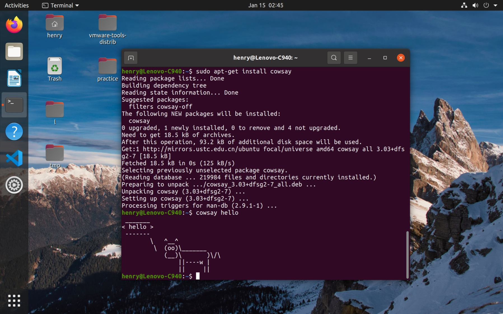

# 在 Windows 上的虚拟机中使用 Linux 系统

在开始本篇教程之前，需要读者：

- 掌握 Windows 下软件的获取与安装
- 从网络上查找并下载资料

Ubuntu是一个常见的Linux发行版。本文主要讲解在VMware Workstation中安装Ubuntu以及一些基本的使用。

## 为什么要使用 Linux？

自行了解

## 什么是 Linux 发行版？

自行了解

## 安装 Ubuntu 操作系统

Ubuntu是比较常见的一个Linux的发行版，而且市场占有率较大。

### 获取安装介质

要使用Ubuntu操作系统，我们需要先获取其安装镜像。去官网上获取最新的安装镜像。

[Ubuntu 官网 - ubuntu.com](https://ubuntu.com/)

[Ubuntu 中文站 - cn.ubuntu.com](https://cn.ubuntu.com/)

进入网站后，选择“下载”进入下载界面，下载 Ubuntu 桌面版。

注：也可以选择其他下载方式，比如 BT 下载等。

### 安装虚拟机软件

常用的虚拟化软件有 VMware Workstation Pro，Oracle VirtualBox 等，Windows 专业版系统还有自带的 Hyper-V。出于易用性等方面的因素考虑，建议使用 VMware Workstation Pro。

VMware Workstation Pro 不是一个免费的软件，如果觉得好用，可以考虑付费购买许可。

### 在虚拟机中安装 Ubuntu

安装好 VMware Workstation Pro 后，新建一个空白的虚拟机，选择“暂时不安装操作系统”。这一步就好像是在实体计算机中模拟除了一个新的计算机。

配置完毕后，在“虚拟机设置”的“CD/DVD 驱动器”中加载上刚刚下载好的安装介质（一般是iso光盘镜像）。这一步就好像是在虚拟的计算机的光驱中，放入了虚拟的光驱。

然后启动虚拟机。由于机器是空白的，默认从光盘启动，则会根据光盘中的程序完成基本的启动。随后，安装过程就会开始。

在设置用户名时，建议选择一个**好记好写**的用户名和密码组合。

### 配置镜像源

> 在常规安装时如果地区选择了“中国”，则这一步并不是必需的。

安装完成进入系统后，可以选择应用中的“Softwares & Updates（软件和更新）”，可以以图形化的方式选择**镜像源**。这里我们选择国内（China）的**镜像源**，这样在下载 package 时，速度会有显著的提升。


### 安装必要软件

Ubuntu 上默认的包管理器是 apt-get。（这里暂时不解释什么是包管理器）。

在应用程序列表中找到并打开“Terminal（终端）”，我们输入一下命令，先执行“**刷新本地的包信息**”的操作。

输入命令时，请**注意命令中字符串之间的空格**。

```bash
sudo apt-get update
```

> 如果读者是命令行的初学者，可以暂时不用思考命令的含义。我们将在下一章介绍命令行的使用。

命令中 `sudo` 的含义表示使用超级管理员权限，这样才能访问到一些普通权限下访问不到的资源。（如果不加 `sudo`，这一步操作会出现“permission denied”的问题）

输入命令后，会提示用户键入密码。注意，输入的密码并不会回显在终端上，只需要在输入完成后按 `Enter` 键即可。

之后命令行会闪过很多信息，等待操作完成后，我们再执行**升级软件包的操作**：

```bash
sudo apt-get upgrade
```

这之后便会下载需要升级的软件包，并进行安装操作，又会花费一些时间。

根据 Linux 的机制，安装后可能需要重启一下机器才能使更改生效。

接下来我们再尝试使用包管理器安装一个小应用：

```bash
sudo apt-get install cowsay
```

命令中 `install` 的后面跟的是要安装的包的名称（package name）。安装完成后，就可以使用 `cowsay` 了。

然后我们在终端中输入如下命令：

```bash
cowsay hello
```



接下来还可以安装构建所需要的工具：

```bash
sudo apt-get install build-essential
```

正如 `build-essential` 其字面上所表示的那样，执行命令将会自动安装构建所必要的若干软件包。

可能还需要安装 CMake：

```bash
sudo apt-get install cmake
```

### 安装 VMware Tools

安装虚拟机的增强工具会使得虚拟机的使用变得方便，比如文件拖拽、剪贴板共享等。点击 Workstation 的“虚拟机”菜单栏，按照步骤安装即可。
